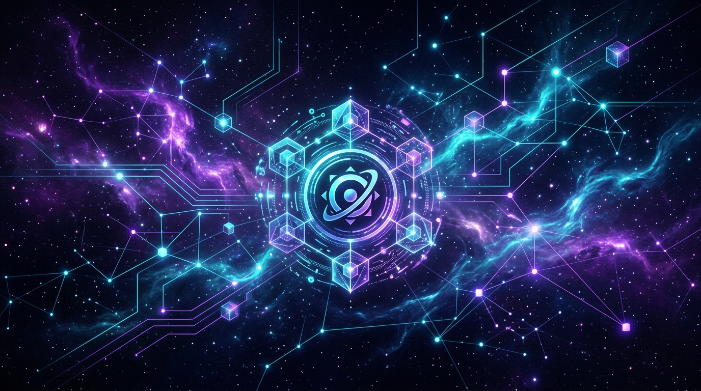
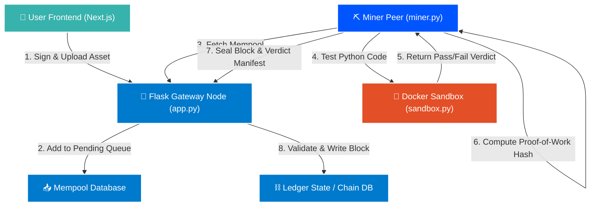

# 🌌 NebulaVerse

> **Decentralized Software Marketplace & Blockchain-Backed Digital Goods Exchange**

<p align="center">
  
</p>

<p align="center">
  
  
  
  
</p>
<p align="center">
  
  
  
  
</p>
<p align="center">
  
  
  
</p>

---

## ☄️ Overview

**NebulaVerse** is a prototype for a decentralized digital goods marketplace and asset-exchange network. It combines a stateful **proof-of-work (PoW) blockchain ledger** with **browser-native cryptography** and **isolated execution containers**. 

The core thesis is simple: *never download unchecked code*. In NebulaVerse, every digital asset uploaded to the market undergoes a black-box verification inside an isolated **Docker Sandbox** before miners write it to the ledger. This ensures that assets are free from runtime crashes and immediate security exploits.

---

## 🚀 Key Features

* **⛓️ Stateful Blockchain Ledger (`backend.py`)**: Custom Python-based blockchain engine supporting `mint` (asset registration), `purchase` (escrow transfers), and `coinbase` (miner rewards) transactions.
* **🔒 RSA & Web Crypto Wallets**: Keypair generation, signing, and verification. Identities are represented as deterministic `nebula_` hex IDs derived from RSA public keys.
* **🐳 Docker Sandbox Verification (L2)**: Code assets (Python files) run automatically inside a network-isolated, memory-capped Docker container during mining. Non-code files (images, audio, video) undergo strict magic-bytes verification.
* **📦 Simulated IPFS Storage**: Dual-stage content persistence routing unverified uploads through `ipfs_storage/unverified` and moving successfully verified assets to `ipfs_storage/verified`, keyed by their SHA-256 integrity hash.
* **📡 P2P Discovery Server (`app.py`)**: Flask-based peer discovery server enabling gateway routing, transaction propagation, and LAN-wide miner node registration.
* **✨ Glassmorphic UI Dashboard**: A Next.js (App Router) interface styled with glassmorphic cards, telemetry metrics, transaction lists, and an integrated wallet explorer.

---

## 📐 System Architecture

The following diagram illustrates how transactions flow through the frontend, the gateway API, the mempool, the sandboxed verification engine, and consensus:



---

## ⚙️ Quick Start

Follow these instructions to run a local three-node simulation (Gateway, Next.js Frontend, and Miner Peer) on Windows.

### 📋 Prerequisites
Ensure you have the following installed:
* **Python 3.10+** (Ensure `Add Python to PATH` is checked during installation)
* **Node.js 20 LTS+**
* **Docker Desktop** (Keep it running in the background for code asset mining)
* **Visual C++ Runtime** (Required for media tools verification)

---

### 📦 Setup Guide

#### Step 1: Initialize Virtual Environment
Open **PowerShell** and navigate to your project directory:
```powershell
python -m venv .venv
.\.venv\Scripts\Activate.ps1
```
> [!NOTE]
> If Windows blocks script execution, run: `Set-ExecutionPolicy -Scope CurrentUser RemoteSigned` and try activating again.

#### Step 2: Install Python Libraries
```powershell
python -m pip install flask flask-cors cryptography docker pytest
```

#### Step 3: Install Frontend NPM Packages
```powershell
cd frontend
npm install
cd ..
```

---

### 🔌 Running the System (Development Mode)

To run in development mode, open **three separate PowerShell windows** (or VS Code terminals) and perform the following commands:

#### Terminal 1: Start Flask Gateway Server
```powershell
.\.venv\Scripts\Activate.ps1
python app.py
```
* **API URL**: `http://localhost:5000`

#### Terminal 2: Run Next.js Frontend Development Server
```powershell
cd frontend
npm run dev
```
* **UI URL**: `http://localhost:3000` (Open this in your browser)

#### Terminal 3: Start the Miner Peer
```powershell
.\.venv\Scripts\Activate.ps1
python miner.py
```
* **Consensus Port**: Runs internal peer listener on port `6001`
* **Mining**: When uploads are queued, switch to this window and press `Enter` to initiate sandbox testing and block hashing.

---

### ⚡ Single-Server Mode (Alternative)
You can compile the frontend and let the Flask server serve both the backend API and the static UI directly on port `5000`:
```powershell
cd frontend
npm run build
cd ..
.\.venv\Scripts\Activate.ps1
python app.py
```
Then navigate to: `http://localhost:5000` in your web browser.

---

## 🛠️ API Documentation

The Flask Gateway provides the following endpoints to interact with the peer network:

| Method | Endpoint | Description |
|:---|:---|:---|
| `GET` | `/api/chain` | Retrieves the entire blockchain ledger (blocks, metadata, and seals). |
| `GET` | `/api/mempool` | Returns transactions waiting in the queue (pending mints or purchases). |
| `GET` | `/api/market_state` | Returns the current ownership records and price mappings. |
| `POST` | `/api/upload` | Uploads an unverified asset payload to the marketplace mempool. |
| `POST` | `/api/buy` | Enqueues a purchase transaction for ownership transition. |
| `POST` | `/api/faucet` | Claims 100 test coins for a specified wallet ID. |
| `GET` | `/api/balance/<wallet_id>`| Retrieves the ledger balance of a specific wallet ID. |
| `POST` | `/api/register_miner` | Registers a LAN miner peer endpoint to the gateway node. |

---

## 📂 Additional Resources

* 📖 **[Run Project Guide](file:///c:/NebulaVerse/NV_V1/RUN_PROJECT_GUIDE.md)**: A zero-coding manual explaining detailed transaction execution.
* 🌌 **[Project Vision](file:///c:/NebulaVerse/NV_V1/VISION.md)**: Deep dive into the cryptographic architecture, transaction structures, and sandbox validation algorithms.
